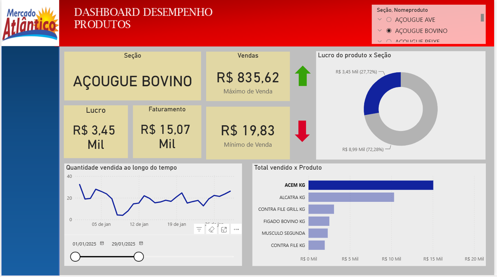

# 📊 Dashboard de Vendas por Seção

Dashboard desenvolvido para análise do desempenho das vendas de um supermercado, utilizando dados reais de vendas referentes ao ano de 2025.

O projeto teve como objetivo transformar os dados de vendas em informações visuais que facilitassem a análise do desempenho por seção, produto e período.

## 🛠️ Tecnologias utilizadas

- PostgreSQL
- SQL
- Power BI
- DAX

## 🔄 Etapas do projeto

### 1. Preparação dos dados

A preparação e consulta dos dados foram realizadas utilizando PostgreSQL.

Foram utilizadas consultas SQL envolvendo:

- JOIN entre tabelas;
- Agregações com SUM;
- GROUP BY;
- Filtros por seção;
- Filtros por período;
- Ordenação dos resultados;
- Seleção dos produtos com maior faturamento.

As consultas utilizadas no projeto estão disponíveis na pasta [`sql`](sql/).

### 2. Análise e visualização

Após a preparação dos dados, as informações foram utilizadas no Power BI para construção do dashboard.

Foram desenvolvidos indicadores e visualizações para permitir a análise do desempenho das vendas.

## 📈 Principais análises

- Faturamento por seção;
- Quantidade vendida;
- Desempenho dos produtos;
- Top 6 produtos por faturamento;
- Evolução das vendas ao longo do tempo;
- Análise por período;
- Filtros interativos.

## 🖥️ Dashboard

### Visão geral



### Desempenho por seção


### Top 6 produtos


### Evolução das vendas


## 📂 Estrutura do projeto

```text
dashboard-vendas-supermercado/
│
├── README.md
│
├── sql/
│   └── consultas.sql
│
└── images/
    ├── dashboard-geral.png
    ├── vendas-por-secao.png
    ├── top-produtos.png
    └── evolucao-vendas.png
